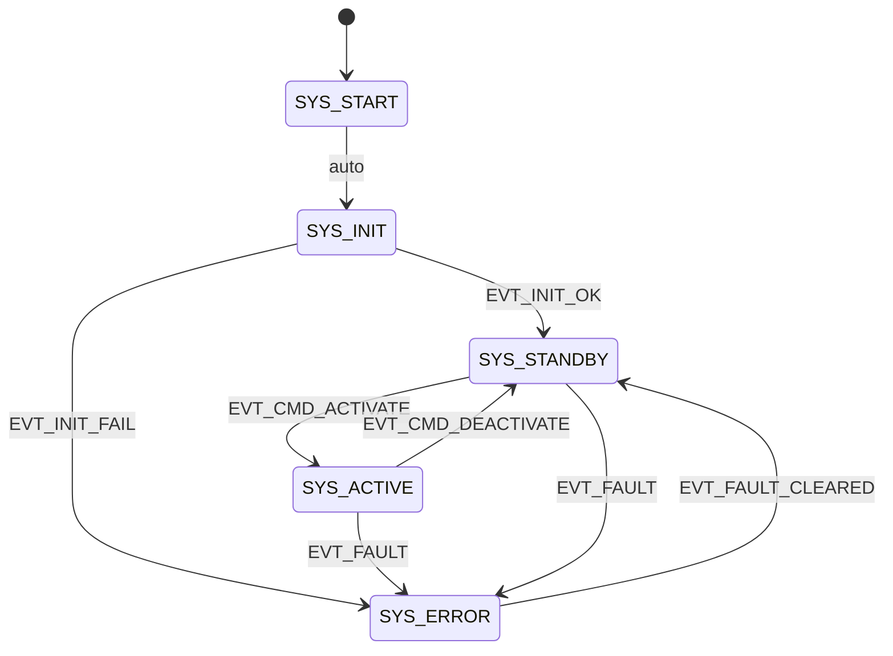
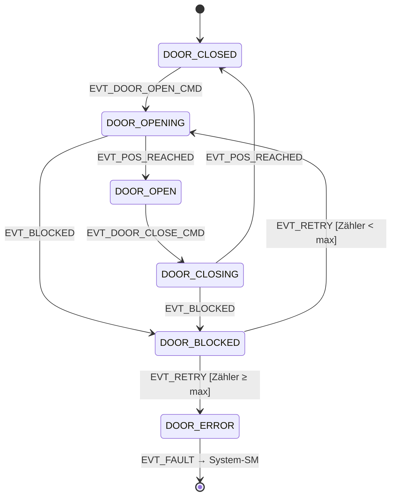

# State Machine – HODOR

Zwei hierarchische Ebenen:
- **System-SM** (`sm_system`): Betriebszustand des Controllers
- **Tür-SM** (`sm_door`): Ablaufzustand der Tür (nur aktiv wenn System = `ACTIVE`)

---

## 1  System-SM

### 1.1  Zustände

| ID | Enum `sm_system_state_t` | Beschreibung |
|----|--------------------------|--------------|
| S0 | `SYS_START`    | Reset/POR; keine Hardware initialisiert |
| S1 | `SYS_INIT`     | Hardware- und Subsystem-Initialisierung |
| S2 | `SYS_STANDBY`  | Bereit; Motor stromlos; Watchdog aktiv |
| S3 | `SYS_ACTIVE`   | Tür-SM läuft; Regler aktiv |
| S4 | `SYS_ERROR`    | Fataler Fehler; Motor gesperrt; Fehlercode gesetzt |

### 1.2  Transitionen

| Von | Nach | Event / Guard | Aktion beim Übergang |
|-----|------|---------------|----------------------|
| S0 | S1 | Immer (automatisch nach Reset) | `hal_init()` starten |
| S1 | S2 | `EVT_INIT_OK` | Watchdog aktivieren, Tasks starten |
| S1 | S4 | `EVT_INIT_FAIL` | Fehlercode setzen, Motor sperren |
| S2 | S3 | `EVT_CMD_ACTIVATE` | Tür-SM initialisieren |
| S3 | S2 | `EVT_CMD_DEACTIVATE` | Tür-SM stoppen, Motor stromlos |
| S3 | S4 | `EVT_FAULT` (beliebig) | Motor sofort sperren, Fehlercode setzen |
| S2 | S4 | `EVT_FAULT` | Motor sperren, Fehlercode setzen |
| S4 | S2 | `EVT_FAULT_CLEARED` \| Guard: Fehler quittierbar | Fehlercode löschen, Watchdog retriggern |

> **Regel:** Jeder Zustand darf `EVT_FAULT` empfangen und nach S4 wechseln.  
> **Regel:** S0 → S1 ist die einzige Transition ohne explizites Event.

### 1.3  Entry/Exit-Aktionen

| Zustand | Entry | Exit |
|---------|-------|------|
| `SYS_INIT`    | `sm_sys_entry_init()`    | — |
| `SYS_STANDBY` | `sm_sys_entry_standby()` | — |
| `SYS_ACTIVE`  | `sm_sys_entry_active()`  | `sm_sys_exit_active()` |
| `SYS_ERROR`   | `sm_sys_entry_error()`   | `sm_sys_exit_error()` |

### 1.4  Diagramm

---

## 2  Tür-SM

Läuft ausschließlich im Kontext `SYS_ACTIVE`. Wird von `sm_sys_entry_active()` gestartet und von `sm_sys_exit_active()` gestoppt.

### 2.1  Zustände

| ID | Enum `sm_door_state_t` | Beschreibung |
|----|------------------------|--------------|
| D0 | `DOOR_CLOSED`   | Tür vollständig geschlossen (Endschalter oder Position = 0) |
| D1 | `DOOR_OPENING`  | Öffnungsbewegung läuft; Regler aktiv |
| D2 | `DOOR_OPEN`     | Tür vollständig offen (Endschalter oder Position = `door_open_mm`) |
| D3 | `DOOR_CLOSING`  | Schließbewegung läuft; Regler aktiv |
| D4 | `DOOR_BLOCKED`  | Bewegung blockiert (Überstrom oder kein Fortschritt) |
| D5 | `DOOR_ERROR`    | Nicht behebbar innerhalb Tür-SM → eskaliert zu `EVT_FAULT` |

### 2.2  Transitionen

| Von | Nach | Event / Guard | Aktion |
|-----|------|---------------|--------|
| D0 | D1 | `EVT_DOOR_OPEN_CMD` | Sollposition = `door_open_mm`, Rampe starten |
| D1 | D2 | `EVT_POS_REACHED` \| Endschalter offen | Regler stoppen, Motor stromlos |
| D2 | D3 | `EVT_DOOR_CLOSE_CMD` | Sollposition = 0, Rampe starten |
| D3 | D0 | `EVT_POS_REACHED` \| Endschalter geschlossen | Regler stoppen, Motor stromlos |
| D1 | D4 | `EVT_BLOCKED` (Überstrom > `t_overcurrent_ms` oder Δpos = 0) | Motor stromlos, Timer starten |
| D3 | D4 | `EVT_BLOCKED` | Motor stromlos, Timer starten |
| D4 | D1 | `EVT_RETRY` \| Guard: Retry-Zähler < `max_retries` | Retry-Zähler++, Rampe neu starten |
| D4 | D5 | `EVT_RETRY` \| Guard: Retry-Zähler ≥ `max_retries` | `EVT_FAULT` an System-SM senden |
| D2 | D3 | `EVT_DOOR_CLOSE_CMD` oder Auto-Close-Timer | Rampe starten |
| D0 | D0 | `EVT_DOOR_CLOSE_CMD` | Ignorieren (bereits geschlossen) |
| D2 | D2 | `EVT_DOOR_OPEN_CMD`  | Ignorieren (bereits offen) |

> **Regel:** `DOOR_BLOCKED` blockiert alle CMD-Events bis Retry oder Error.  
> **Regel:** `DOOR_ERROR` sendet immer `EVT_FAULT` an System-SM und wartet auf Reset.

### 2.3  Entry/Exit-Aktionen

| Zustand | Entry | Exit |
|---------|-------|------|
| `DOOR_OPENING`  | `ctrl_set_target(door_open_mm)`, `ctrl_enable()` | — |
| `DOOR_CLOSING`  | `ctrl_set_target(0)`, `ctrl_enable()` | — |
| `DOOR_CLOSED`   | `ctrl_disable()`, `mot_brake()` | — |
| `DOOR_OPEN`     | `ctrl_disable()`, `mot_brake()` | — |
| `DOOR_BLOCKED`  | `ctrl_disable()`, `mot_coast()`, `sm_door_start_retry_timer()` | `sm_door_reset_retry_timer()` |
| `DOOR_ERROR`    | `sm_sys_send_event(EVT_FAULT)` | — |

### 2.4  Diagramm

---

## 3  Event-Typen

| Event | Quelle | Beschreibung |
|-------|--------|--------------|
| `EVT_INIT_OK`          | Init-Task | Alle Subsysteme bereit |
| `EVT_INIT_FAIL`        | Init-Task | Mindestens ein Subsystem ausgefallen |
| `EVT_CMD_ACTIVATE`     | MQTT / Webserver / I/O | Controller aktivieren |
| `EVT_CMD_DEACTIVATE`   | MQTT / Webserver / I/O | Controller deaktivieren |
| `EVT_FAULT`            | Beliebig | Fataler Fehler |
| `EVT_FAULT_CLEARED`    | Webserver / I/O | Fehler quittiert |
| `EVT_DOOR_OPEN_CMD`    | MQTT / I/O | Tür öffnen |
| `EVT_DOOR_CLOSE_CMD`   | MQTT / I/O / Auto-Timer | Tür schließen |
| `EVT_POS_REACHED`      | Regler / Endschalter | Zielposition erreicht |
| `EVT_BLOCKED`          | Strommessung / Regler | Blockierung erkannt |
| `EVT_RETRY`            | Retry-Timer | Blockierungs-Retry auslösen |

---

## 4  Fehler-Codes (`hodor_error_t`)

| Code | Konstante | Ursache |
|------|-----------|---------|
| 0x01 | `ERR_INIT_HAL`       | HAL-Initialisierung fehlgeschlagen |
| 0x02 | `ERR_INIT_SENSORS`   | ADC/Stromsensor nicht erreichbar |
| 0x10 | `ERR_OVERCURRENT`    | Dauerhafter Überstrom |
| 0x11 | `ERR_BLOCKED_MAX`    | Max. Retries überschritten |
| 0x20 | `ERR_WATCHDOG`       | Software-Watchdog ausgelöst |
| 0x21 | `ERR_COMM_LOST`      | WiFi/MQTT dauerhaft ausgefallen (optional Fatal) |

---

## 5  Implementierungshinweise

- SM läuft in dediziertem FreeRTOS-Task auf **Core 1** (Prio: hoch)
- Events werden per `xQueueSend()` eingestellt; SM-Task liest per `xQueueReceive()`
- Kein direkter Funktionsaufruf aus ISR in SM; nur `xQueueSendFromISR()`
- Zustandsvariablen sind `static` innerhalb `sm_system.c` / `sm_door.c`; kein globaler Zugriff
- Aktuellen Zustand nach außen nur per Getter `sm_sys_get_state()` / `sm_door_get_state()`
